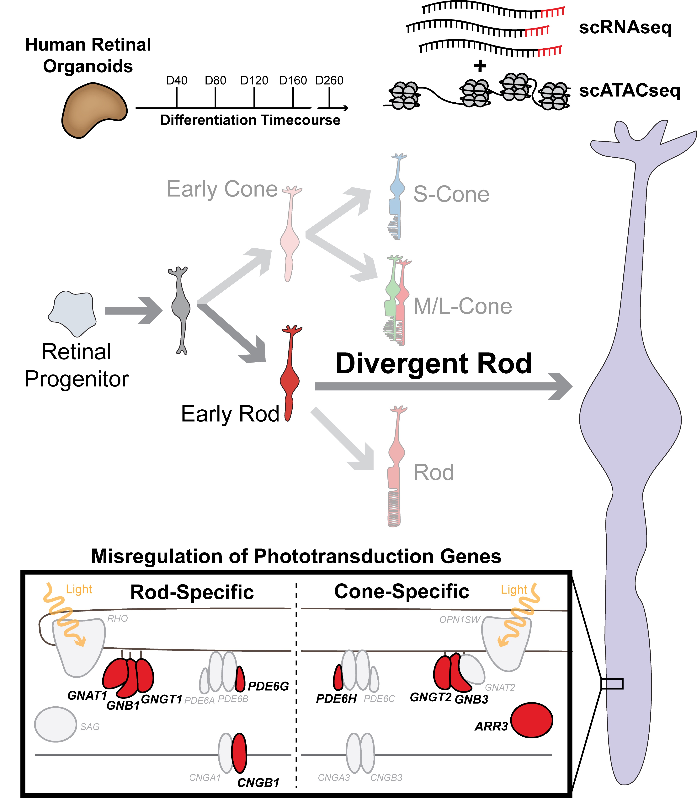

# nr2e3_organoid_2023

#  NR2E3 loss disrupts photoreceptor cell maturation and fate in human organoid models of retinal development.
code associated with Mullin, Bohrer, et al. 2023 (pending bioRxiv)

<b>TITLE:</b>

NR2E3 loss disrupts photoreceptor cell maturation and fate in human organoid models of retinal development.

<b>ABSTRACT:</b>

While dysfunction and death of light-detecting photoreceptor cells underlie most inherited retinal dystrophies, knowledge of the species-specific details of human rod and cone photoreceptor cell development remains limited. Here, we generate retinal organoids carrying retinal disease-causing variants in NR2E3, as well as isogenic and unrelated controls. Organoids were sampled using single-cell RNA sequencing across the developmental window encompassing photoreceptor specification, emergence, and maturation. Using scRNAseq data, we reconstruct the rod photoreceptor developmental lineage and identify a branchpoint unique to the disease state. We show that the rod-specific transcription factor NR2E3 is required for the proper expression of genes involved in phototransduction, including rhodopsin, which is absent in divergent rods. NR2E3-null rods additionally misexpress several cone-specific phototransduction genes. Using joint multimodal single-cell sequencing, we further identify putative regulatory sites where rod-specific factors act to steer photoreceptor cell development. Finally, we show that rod-committed photoreceptor cells form and persist throughout life in a patient with NR2E3-associated disease. Importantly, these findings are strikingly different than those observed in Nr2e3 rodent models. Together, these data provide a roadmap of human photoreceptor development and leverage patient iPSCs to define the specific roles of rod transcription factors in photoreceptor cell emergence and maturation in health and disease.

<b>DATA EXPLORATION:</b>

 Please see the study of the same name on Spectacle (https://spectacle.ivr.uiowa.edu/app/spectacle/) to interact with all single-cell plots from the paper.

<b>GRAPHICAL ABSTRACT:</b>

 
